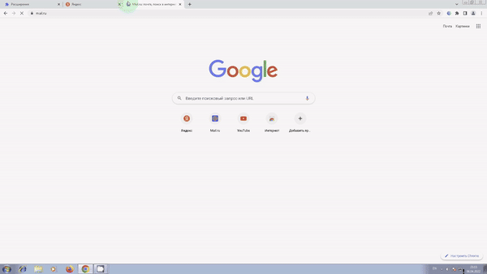

# simple_sch_adblocker

## Многофункциональное расширение для браузера

## Описание

Этот проект представляет собой многофункциональное расширение для веб-браузеров, написанное на современных языках программирования HTML, CSS и JavaScript. Основная цель расширения - улучшить пользовательский опыт в интернете, предоставляя различные функции:

- **Стилизация web-страниц**: Включает в себя возможность применения тёмной темы для улучшения чтения и снижения утомляемости глаз.
  
- **Блокировка рекламы**: Эффективно блокирует различные виды рекламы, включая контекстную, баннерную и другие навязчивые формы. Это актуальное и практичное решение в современном интернете, где реклама присутствует практически на каждом сайте.

- **Блокировка угроз безопасности**: Расширение предупреждает и блокирует возможные угрозы безопасности, которые могут появиться на посещаемых веб-сайтах.

- **Блокировка доступа к недостоверной информации**: Запрещает доступ к информационным сайтам, распространяющим недостоверную или вводящую в заблуждение информацию.

## Зачем это нужно?

В большинстве случаев расширения для браузера выполняют только одну конкретную функцию. В отличие от них, мое расширение объединяет в себе несколько полезных и актуальных функций, делая его универсальным и многофункциональным инструментом для улучшения интернет-серфинга.

## Установка

1. Скачайте расширение из репозитория.
2. Разархивируйте файлы на вашем компьютере.
3. Откройте веб-браузер, перейдите в меню расширений.
4. Включите режим разработчика и загрузите распакованное расширение.

## Примечания

Made by Estle while in 11 grade as the school project

I'm not really proud of this project. It's for sure shitty, though it's good for Growth :feelsgood: 

I'll do much better in my next projects. Dreams really do come true only if you work your ass off.

Always HUNGRY 🇭🇺 Always FOOLISH 🤪
